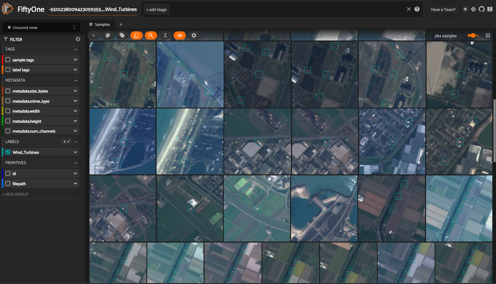

# Sentinel-2 & OSM - Automatic Labelling Engine



# Setup and start (Windows)
<pre>
Prerequirements: Python (was tested for > 3.9) and Pip
</pre>

## Clone the project to your local machine
```
git clone <repository_url>
```
## Optional: Create Virtual Environment for local dependencies (Windows):
```
pip install virtualenv
```
```
python -m venv venv
```
```
venv\Scripts\activate
```
## Install Project Dependencies (takes a few minutes)
```
pip install -r requirements.txt
```
## Google Earth Engine

Install Google Cloud CLI for GEE to work without docker:
see https://cloud.google.com/sdk/docs/install

## Fiftyone Desktop - (should also work through requirements installation already)
Install fiftyone Desktop to use the desktop version - this is only necessery if you want to visualize the resulting COCO dataset with the fiftyone app. 
```
pip install "fiftyone[desktop]"
```

## Navigate into the src folder 
```
cd src
```
## Start code with the following comand: 
```
python modules/main.py
``` 
</kbd>

&nbsp; 


# Rrunning your own queries
<pre>
-> Create a new python file within the src/modules/config folder
-> specifiy the variables 
-> to simplify, copy the code from another config file (e.g. Example_Config_lighthouses_Sweden.py)
</pre>

<span style="color:red">All variables have to be set</span>

### General Variables: 
1.  query (string)
-  A valid NODE ONLY query in Open street map. Test under the following link: https://overpass-turbo.eu/

- Example: All Lighthouse nodes in Sweden
```json
[out:json];
area["ISO3166-1"="SE"]["admin_level"="2"]->.searchArea;
(
   node["man_made"="lighthouse"](area.searchArea);
 );
out body;
```
### Workflow Variables:
-> if you are starting a new project - set all to true

2. get_OSM_nodes (boolean) 
```If System should request Node data from OSM```
3. download_img (boolean) ```if the satellite images are to be downloaded with Google Earth Engine```
4. convert_s2 (boolean)```if the satellite tif bands should be converted to GeoTif and PNG images```
5. create_dataset (boolean)```if a coco dataset should be created from the png images```

### Specification Variables:
6. Image_Size (int) ```Specify the size of the Image to be downloaded in meters```
7. Object_Size (int) ```Specify the size of the Objects that are supposed to be labelled in meters```
8. filename (string) ```Filename for Image Consistency```
9. element_name (string) ```Name of the Object to be labelled```
10. remove (boolean) ``` if the image folder should be removed if there is one ```
11. n_of_scene (int) ```ow many images in total do you want to download (set to 0 if all available should be downloaded)```
12. n_images (int) ```from how many different dates the images are supposed to be downloaded```

### Additional Variables:
13. cloud_percentage (double) ```[0-1] how big the maximum cloud fraction should be present within an image```
14. variability_threshhold (int) ```how big the allowed color variablility is within the image (can be set to exclude image borders and sensor mistakes)```
15. start_dates ([string]) ```FORMAT: ['2019-01-01'] - yyyy-mm-dd - start dates for the image request```
16. end_dates ([string]) ```FORMAT: ['2019-12-01'] - yyyy-mm-dd - end dates for the image request```
17. csv_file_path (string) ```filepath for saving coordinates from OSM```
18. filePath (string) ```filepath for saving the buffered coordinates after coordinate search```
19. get_way_centers (boolean) ```if you use way centers - still in testing ```
20. make_bounding_box_image (boolean) ``` if you want to create an image of the bounding boxes needed for the search```
21. bounding_box_image_path (string) ```where you want to save it```

# System Specifications
## Workflow

## Usecase

## Class 


# ------- DOCKER --------
## Build Docker 
```
docker build -t satellite_osm_dataset .
```

## Run Docker 
```
docker run -i -t satellite_osm_dataset
```
